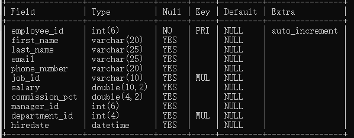
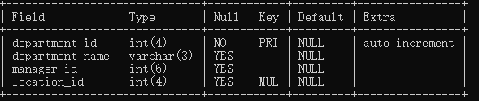
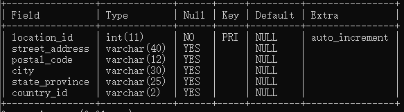
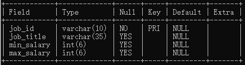
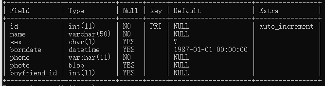
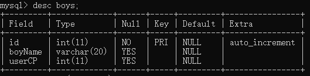
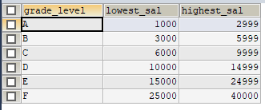

### 1、数据查询语言(database query language)

#### 1、数据库表

- myemployees 数据库

- employees

  - 

- departments

  - 

- location

  - 

- jobs

  - 

    

#### 2、基础查询

```mysql
# 进阶1：基础查询
/*
user database;

语法:select 查询列表 from 表名；

着重号`用于区分关键字和字段名。
*/
```

- 特点:
  查询列表可以是:表中的字段，常量值、表达式、函数
  查询的结果是一个虚拟表格
- 查询单个字段
  - select last_name from employees;
- 查询多个字段
  - select last_name ,salary,email from employees;
- 查询所有字段
  - select  * from employees;
- 查询常量
  - select 100;
  - select join;
- 查询表达式
  - select 100%98;
- 查询函数
  - select version();#调用该方法和函数。
- 起别名 ：便于理解，如果要查询的字段有重名，使用别名可以区分开来
  - select 100%98; --> select 100%98 as 结果；
  - select  last_name as 姓，first_name as 名 from employees；
  - select  last_name  姓，first_name  名 from employee；
- 案例:别名特殊符号需要加单引号或者双引号。
  - select salary as 'out put'  from employees;
- 去重:
  - select distinct department_id from employees  ;
- +号:将员工的名和姓连接
  - mysql 中的加号仅仅只有运算符的功能，不能拼接字符串。
  - select '123'+90 其中一方为字符型，试图将字符型数据转换成数值型。
    - 如果转换成功，则继续做加法运算。
    - 如果转换失败，则将字符型数值变为0。
    -  只要一方为null ,结果肯定是null
  - **要拼接字符串，需要使用concat**
    - select concat(last_name ,first_name) as xingming from employees;
- **ifnull** 
  - SELECT IFNULL(commission_pct,0) AS 奖金率,commission_pct FROM employees;

#### 3、条件查询

```mysql
#语法格式
select 
	查询列表
from 
	表名
where
	筛选条件;
```

###### 条件分类

- 按照条件表达式筛选 条件运算符 >  <   =     !=     <>     >=     <=
- 按照逻辑表达式筛选  &&   ||    !   and or not 用于连接条件表达式
  - and 和&& 的意思一样
  - || 和or 意思一样
  - ! 或not  取反
- 模糊查询  like between in  is null

1. **case1**:查询工资大于12000的员工信息
   - SELECT * FROM employees WHERE salary>12000;
2. **case2**： 查询部门编号不等于90号的员工名和部门编号。
   - SELECT last_name,department_id FROM employees WHERE department_id !=90;
   - 建议使用 SELECT last_name,department_id FROM employees WHERE department_id <>90;
3. **case3**: 查询工资在 10000 到20000之间的员工名，工资，以及奖金
   - SELECT last_name,salary,commission_pct FROM employees WHERE salary>10000 AND salary<20000;
4. **case4**:查询部门编号不是在90到110之间，或者工资高于15000的员工信息
   - SELECT * FROM employees WHERE department_id <90 OR department_id>110 OR salary>15000;
   - SELECT * FROM employees WHERE NOT (department_id >=90 AND department_id<=110) OR salary>15000;
5. **case5**:查询员工名字中包含a的员工信息
   - SELECT * FROM employees WHERE last_name LIKE '%a%';
   - 通配符
     - %  任意多个字符，包含零个
     - _ 任意单个字符
6. 查询员工名字，第三个字符为n ,第五个字符为l的员工名和工资
   - SELECT last_name,salary FROM employees WHERE last_name LIKE  '\_\_n\_l%';
7. <font color='red'>**查询员工名中，第二个字符为下划线的员工名**(涉及转义字符)也可以自己指定转义字符</font>。
   - SELECT last_name FROM employees WHERE last_name LIKE  '_\_%';
   - mysql 支持自己指定转义字符
   - SELECT last_name FROM employees WHERE last_name LIKE  '_$\_%' escape '$';（<font color='red'>指定$为转义符号，推荐使用这个</font>）
8. 查询员工编号在100到200之间的员工信息
   - select * from employees where employee_id between 100 and 120;
   - 使用between and 较为简洁
   - between and 包含临界值。
   - <font color='red'>两个临界值不能颠倒，</font>
9. 查询员工的工种编号是，IT_PROG,AD_VP,AD_PRES中的一个员工名和工种编号。
   - SELECT last_name,job_id FROM employees WHERE job_id IN ('IT_PROT','AD_VP','AD_PRES');
   - In用于判断某字段的值是否属于in列表中的某一项
   - 使用in提高了语句的简洁度。
   - in 列表的值类型必须一致
   - in 列表里面的值，不能使用通配符
10. 没有奖金的员工名和奖金率。
    - SELECT last_name,commission_pct FROM employees WHERE commission_pct IS NULL 不能用等值判断。
11. 安全等于<=> 
    - 可以用来判断null  
      - SELECT last_name,commission_pct FROM employees WHERE commission_pct<=>NULL;
    - 可以判断普通的类型值。
    - 可读性比较差
    - is null仅仅可以判断null值。
12. % 不能匹配null

#### 4、排序查询

```sql
select 查询列表
	from 表
		[where 筛选条件]
	order by 排序列表 
	asc|desc
```

1. 查询员工的信息，要求工资从高到低
   - ​	SELECT last_name,salary FROM employees ORDER BY salary DESC;
   - ​    SELECT last_name,salary FROM employees ORDER BY salary  ASC;  
   - 不写默认按升序
2. 查询部门编号>=90的员工信息，按入职时间的先后进行排序。【添加筛选条件】
   1. select last_name,department_id,hiredate from employees where department_id>=90 order by hiredate;
3. 按年薪的高低显示员工信息和年薪，【按表达式排序】
   1. SELECT *,salary*12*(1+IFNULL(commission_pct,0)) 年薪 FROM employees ORDER BY salary*12*(1+IFNULL(commission_pct,0)) DESC;
4.  按年薪的高低显示员工信息和年薪，【按年薪排序】
   1. SELECT *,salary*12*(1+IFNULL(commission_pct,0)) 年薪 FROM employees ORDER BY 年薪 DESC；
5. 按姓名的长度显示员工的工资和工资【按函数进行排序】
   1. SELECT last_name,salary FROM employees ORDER BY LENGTH(last_name) asc;
6. **查询员工信息，先按照工资排序，再按照员工编号排序【按多个字段排序】**
   1. SELECT last_name,salary,employee_id FROM employees ORDER BY salary ASC,employee_id DESC;

note:

order by 支持

- 单个字段，多个字段，表达式，函数，别名
- order by 子句，一般放在查询语句的最后面，limit子句除外。

#### 5、常见函数

```mysql
select 函数名(实参列表) 【from 表】;
#单行函数 concat,length,ifnull
#分组函数 ，做统计使用,聚合函数
```

##### 1、单行函数、

- 字符函数
  - length() 获取参数值的字节数组
    - select length('张三丰hahaha'); #15
    - 使用 show variabels like '%char%' 查看字符集
    - utf8 下中文三个字节，字符一个字节。
  - concat 拼接字符串
  - upper ,lower 大小写转换
    - 将姓变大写，名变小写，然后拼接【函数可以嵌套函数】
      - SELECT CONCAT(UPPER(last_name),LOWER(first_name)) 姓名 FROM employees;
  - substr,substring
    - 注意索引是从1开始
      - 姓名中首字母大写，其他字符小写，然后用_拼接起来，显示出来。
        - SELECT CONCAT(UPPER(SUBSTR(last_name,1,1)),'_',LOWER(SUBSTR(last_name,2))) output
          FROM employees;
  - instr 返回字串在字符串中的第一次起始索引，如果找不到返回0
  - trim 
    - 去空格
    - trim('a' from 'aaaaaaaabbbbbbaaa')；去掉**前后**的a
  - lpad
    - 用指定的字符实现左填充，如果长度超过了，右边截掉
  - rpad
    - 同上
  - repalce
    - 替换 所有的都替换
- 数学函数
  - round 
    - 四舍五入
    - 可以指定保留多少位
  - ceil 
    - 向上取整
  - floor 
    - 向下取整
  - truncate
    - 截断
  - mod
    - 取余取模
    - mod(a,b) a-a/b*b
- 日期函数
  - now() 
    - 返回当前日期和时间
  - curdate 
    - 返回当前系统时间，不包含日期
  - Year 等
    - 可以获取指定的部分，年、月、日、小时、分钟、秒
  - str_to_date 将日期格式的字符转换成指定格式的日期
    - str_to_date("9-13-1999",'%m-%d-%Y')
  - date_format 将日期转换成字符串
    - date_format('2018/6/6','%Y年%m月%d日')

- 其他函数

  - version()
  - database()
  - user()
  - password() 返回改字符的密码形式
  - md5()返回该字符串的md5加密形式。

- 流程控制函数

  - if 函数

    - SELECT IF(10>5,'大','小');
    - SELECT last_name,commission_pct, IF(commission_pct IS NULL,'没奖金','有奖金') 备注 FROM employees;

  - case 函数

    - 类似switch  case 的效果

    - ```mysql
      case 要判断的字段或表达式
      when 常量1 then 要显示的值或语句1;
      when 常量2 then 要显示的值或语句2;
      ...
      else 要显示的值n 或语句n;
      end
      ```

      ```mysql
      /*
      案例:查询员工的工资，要求
      部门号=30 显示的工资为1.1倍
      部门号=40 显示的工资为1.2倍
      部门号=50 显示的工资为1.3倍
      其他部门，显示的工资为原工资;
      */
      
      SELECT salary 原始工资,department_id,
      CASE department_id
      WHEN 30 THEN salary*1.1
      WHEN 40 THEN salary*1.2
      WHEN 50 THEN salary*1.3
      ELSE salary
      END AS 新工资
      FROM employees;
      ```

    - 多重if

    - ```mysql
      /*
      case
      when 条件1 then 要显示的值1或语句1
      when 条件2 then 要显示的值2或语句2
      ...
      else 要显示的值n或语句n 
      end
      */
      # 查询员工工资，如果工资大于2w显示A级别
      #如果大于1.5w显示B级别
      #如果大于1w 显示c级别
      #否则显示D级别
      
      SELECT salary,
      
      CASE
      WHEN salary>20000 THEN 'A'
      WHEN salary>15000 THEN 'B'
      WHEN salary>10000 THEN 'C'
      ELSE 'D'
      END AS 工资级别
      FROM employees;
      ```

      

##### 2、聚合函数

- sum 
  - SELECT SUM(salary) FROM employees;
- avg
  - SELECT AVG(salary) FROM employees;
- max
  - SELECT MAX(salary) FROM employees;
- min
  - SELECT MIN(salary) FROM employees;
- count
  - SELECT COUNT(salary) FROM employees;
- 参数支持哪些类型
  - 数值型 sum ,avg
  - max,min 支持字符串和日期型
  - count 支持任何类型计数【只计算不为null的值】
- 是否忽略null
  - sum 忽略null
  - avg 忽略null
- 可以和distinct 搭配使用
  - SELECT SUM(DISTINCT salary),SUM(salary) FROM employees;
  - SELECT COUNT(DISTINCT salary),COUNT(salary) FROM employees;
- count函数详细介绍
  - SELECT COUNT(*) FROM employees;  #统计行数
  - SELECT COUNT(1) FROM employees;  #统计行数
  - 效率:
    - MYSIAM 引擎下，count(*)的效率最高
    - INNODB引擎下，count(*)和count(1)差不多，但是比count(字段)要高
- 和分组函数一同查询的字段有限制
  - 和分组函数一同查询的字段要求事group by后的字段。

#### 6、分组查询

每个部门的平均工资

```mysql
select 分组函数，列(要求出现在group by 的后面)
from table
[where condition]#where 必须放在group by 前面
group by 分组的列表
[order_by 子句]
#注意
#查询列表必须特殊，要求是分组函数和group by 后出现的字段
```

- 查询每个工种的最高工资

```mysql
#简单的分组查询
SELECT MAX(salary),job_id FROM employees 
GROUP BY job_id;
```

- 查询每个位置上的部门个数

```mysql
SELECT COUNT(*),location_id 
FROM departments 
GROUP BY location_id;
```

- 查询邮箱中包含a字符的，每个部门的平均工资

```mysql
SELECT AVG(salary),department_id
FROM employees
WHERE email LIKE '%a%'
GROUP BY department_id;
```

- 查询有奖金的的，每个领导手下员工的最高工资

```mysql
SELECT MAX(salary),manager_id
FROM employees 
WHERE commission_pct IS NOT NULL
GROUP BY manager_id;
```

- 复杂筛选条件

  - 查询哪个部门的员工个数大于2【**分组后的筛选**】

    - ```msyql
      SELECT COUNT(*) member,department_id
      FROM employees
      GROUP BY department_id
      HAVING member>2;
      ```

  - 查询每个工种有奖金的员工的最高工资>12000的工种编号和最高工资

    - ```mysql
      SELECT MAX(salary),job_id
      FROM employees
      GROUP BY job_id
      HAVING MAX(salary)>12000;
      ```

  - 查询领导编号>102的每个领导手下最低工资>5000的领导编号，以及最低工资

    - ```mysql
      SELECT MIN(salary),manager_id
      FROM employees
      WHERE manager_id>102
      GROUP BY manager_id
      HAVING MIN(salary)>5000;
      ```

- <font color=red>重点</font>

  - 分组查询中筛选条件分为两类

    - 分组前筛选  数据源是原始表，需要位于group by 子句前面，使用where

    - 分组后筛选  数据源是分组后的结果集，位于group by 子句后面,使用having

    - 分组函数做条件肯定是放在having 字句中

    - 能用分组前筛选，就优先放在分组前筛选。

- **按表达式或者函数分组**
  
  - 按员工姓名长度分组，查询每个分组的员工个数，筛选员工个数大于5的有哪些    
  
    - ```mysql
      SELECT COUNT(*),LENGTH(last_name)
      FROM employees 
      GROUP BY LENGTH(last_name)
      HAVING COUNT(*)>5;
      ```
  
- **按多个字段分组**
  
  - 查询每个部门，每个工种的员工的平均工资
    
  - ```
    SELECT AVG(salary),department_id,job_id
    FROM employees
    GROUP BY department_id,job_id;
    ```
  
- **添加排序**

  - ```mysql
    SELECT AVG(salary) a_s,department_id,job_id
    FROM employees
    GROUP BY department_id,job_id
    ORDER BY a_s;#order 放在最后面
    ```

- difference 查询员工最高工资和最低工资的差距

  - ```mysql
    SELECT MAX(salary)-MIN(salary) difference
    FROM employees;
    ```

- 查询所有部门的编号，员工数量和工资平均值，并按平均工资降序

  - ```mysql
    SELECT department_id,COUNT(*),AVG(salary)
    FROM employees 
    GROUP BY department_id
    ORDER BY AVG(salary) DESC;
    ```

#### 7、连接查询

​	又称为多表查询，当查询的字段来自多个表。

​	笛卡尔乘积错误情况，表1 m行，表2 n行，结果m*n行。

###### 1、用到的表结构

- girls
  - 
  - 

按年份分类

- sq192标准 仅仅支持内连接
- sql199标准【推荐】 :支持内连接，外连接(左外和右外)+交叉连接


##### sql192

- 内连接

  - 等值连接

    - ```mysql
      #找到对应女生的男伴，本质还是对笛卡尔结果集进行筛选
      SELECT `name`, boyname
      FROM boys,beauty
      WHERE beauty.`boyfriend_id`=boys.`id`;
      ```

    - ```mysql
      #查询员工名和对应的部门名
      SELECT last_name,department_name 
      FROM employees,departments
      WHERE employees.`department_id`=departments.`department_id`; 
      ```

    - **在筛选条件那里，为表起别名。**

    - **起了别名之后，就不能再使用原始名称了，因为from 里面的最先执行。**

    - from 那里的顺序可以换。

    - ``` mysql
      #查询有奖金的员工名和部门名称
      SELECT last_name,d.department_name,commission_pct
      FROM employees e,departments d
      WHERE e.`department_id`=d.`department_id` 
      AND e.`commission_pct` IS NOT NULL;
      ```

    - ```mysql
      #查询每个城市的部门个数
      SELECT COUNT(*) ,city
      FROM departments d,locations l
      WHERE d.`location_id`=l.`location_id`
      GROUP BY city;
      ```

    - ```mysql
      #查询有奖金的部门的
      SELECT 
        d.department_name,
        d.`manager_id`,
        MIN(salary) 
      FROM
        departments d,
        employees e 
      WHERE d.`department_id` = e.`department_id` 
        AND e.`commission_pct` IS NOT NULL 
      GROUP BY d.`department_id`,
        d.`manager_id`;
      ```

    - ```mysql
      #查询每个工种的工种名和员工个数，并且按员工个数降序
      SELECT 
        job_title,
        COUNT(*) 
      FROM
        jobs j,
        employees e 
      WHERE j.`job_id` = e.`job_id` 
      GROUP BY j.`job_id` 
      ORDER BY COUNT(*) DESC ;
      ```

    - ```mysql
      #查询员工名，部门名，和所在的城市
      SELECT 
        last_name,
        department_name,
        city 
      FROM
        employees e,
        departments d,
        locations l 
      WHERE e.department_id = d.`department_id` 
        AND d.location_id = l.location_id 
        AND city LIKE 's%' ;
      ```

    - 多表等值连接，为交集部分

    - n表连接，至少需要n-1个条件

    - 表顺序没有要求

    - 可以搭配前面的所有查询字句来使用。

  - 非等值连接

    - 

    - ```mysql
      #查询员工的工资和工资级别
      SELECT 
        salary,
        grade_level 
      FROM
        employees e,
        job_grades g 
      WHERE salary BETWEEN g.`lowest_sal` 
        AND g.`highest_sal` ;
      ```

  - 自连接

    - ```mysql
      #查询员工名以及上级的名字
      SELECT 
        e.`last_name`,
        e.`employee_id`,
        m.`employee_id`,
        m.`last_name` 
      FROM
        employees e,
        employees m 
      WHERE e.`manager_id` = m.`employee_id` 
      ```

  - 联系

    - ```mysql
      #查询90号部门员工的job_id和90号部门的location_id
      SELECT job_id,location_id
      FROM employees e,departments d
      WHERE e.`department_id`=d.`department_id`
      AND e.`department_id`=90;
      ```

    - ```mysql
      #查询所有有奖金的员工的last_name ,department_name,location_id,city
      SELECT 
        last_name,
        e.department_id,
        d.location_id,
        city 
      FROM
        employees e,
        departments d,
        locations l 
      WHERE e.`department_id` = d.`department_id` 
        AND d.`location_id` = l.`location_id` 
        AND e.`commission_pct` IS NOT NULL ;
      ```

    - ```mysql
      #查询每个工种，每个部门的部门名，工种名和最低工资
      SELECT 
        job_title,
        d.department_name,
        MIN(salary) 
      FROM
        employees e,
        departments d,
        jobs j 
      WHERE e.`department_id` = d.`department_id` 
        AND e.`job_id` = j.`job_id` 
      GROUP BY job_title,
        d.department_id ;
      ```

    - ```mysql
      #查询每个国家下的部门个数大于等于2的国家编号
      SELECT country_id,COUNT(*) 部门个数
      FROM departments d,locations l
      WHERE d.`location_id`=l.`location_id`
      GROUP BY country_id
      HAVING COUNT(*)>=2;
      ```

##### sql199标准

  ```mysql
  #语法结构
  select 查询列表
  from 表1 别名 【连接类型】
  join 表2 别名 on 连接条件
  【where 筛选条件】
  【分组】
  【having】
  【排序】
  
  #分类
  内连接 inner
  外连接
  	1、左外 left [outer]
  	2、右外 right[outer]
  	3、全外 full[outer]
  交叉连接:cross
  ```

  - 内连接

      - ```mysql
        select 查询列表
        from 表1 别名
        inner join 表2 别名
        on 连接条件
        ```

        - 等值连接

          - ```mysql
            #查询员工名，部门名
            SELECT 
              last_name,
              department_name 
            FROM
              employees e 
              INNER JOIN departments d 
                ON e.`department_id` = d.`department_id`;
            #调换顺序不影响结果
            ```

          - ```mysql
            #查询名字包含e 的员工名和工种名
            SELECT 
              last_name,
              job_title 
            FROM
              employees e 
              INNER JOIN jobs j 
                ON e.`job_id` = j.`job_id` 
            WHERE last_name LIKE '%e%' ;
            ```

          - ```mysql
            #查询部门个数>3的城市名和部门个数
            SELECT 
              city,
              COUNT(*) 
            FROM
              locations l 
              INNER JOIN departments d 
                ON l.`location_id` = d.`location_id` 
            GROUP BY city 
            HAVING COUNT(*) > 3 ;
            ```

          - ```mysql
            #查询哪个部门的员工数量>3 的部门名和员工个数，并按个数降序
            SELECT 
              department_name,
              COUNT(*) 
            FROM
              employees e 
              INNER JOIN departments d 
                ON e.`department_id` = d.`department_id` 
            GROUP BY department_name 
            HAVING COUNT(*) > 3 
            ORDER BY COUNT(*) DESC;
            ```

          - ```mysql
            #查询员工名、部门名、工种名、并按 部门名降序【多表】
            SELECT 
              last_name,
              department_name,
              job_title 
            FROM
              employees e 
              INNER JOIN departments d 
                ON d.`department_id` = e.`department_id` 
              INNER JOIN jobs j 
                ON j.`job_id` = e.`job_id` 
            ORDER BY department_name DESC ;
            ```

          - 可以添加排序，分组筛选

          - inner可以省略

          - 筛选条件放在where后面，连接条件放在on 后面，提高分离性，便于阅读。

          - 和inner92语法的等值连接效果是一样的，都是查询交集部分。

        - 非等值连接

          - ```mysql
            #查询员工的工资级别
            select 
              salary,
              grade_level 
            from
              employees e 
              inner join job_grades g 
                on e.`salary` between g.`lowest_sal` 
                and g.`highest_sal` ;
            ```

          - ```mysql
            查询工资级别的个数>2的个数，并且按工资级别降序。
            SELECT 
              COUNT(*),
              grade_level 
            FROM
              employees e 
              INNER JOIN job_grades g 
                ON e.`salary` BETWEEN g.`lowest_sal` 
                AND g.`highest_sal` 
            GROUP BY grade_level 
            HAVING COUNT(*) > 20 
            ORDER BY grade_level DESC;
            ```

        - 自连接

- 外连接

  ​	引入：查询男朋友不在男神表的女神名

  ​	**外连接的查询结果为主表中的所有记录。**

  ​	**如果从表中有和它匹配的，则显示匹配的值。**

  ​	**如果从表中没有和它匹配的，则显示null。**

  ​	**外连接查询结果=内连接结果+主表中有二从表没有的记录。**

  ​	左外连接:left 左边的是主表

  ​	右外连接:right右边的是主表

  左外和右外交换可以实现同样的结果

  全外，mysql不支持，就是左外加右外的结果。

  ```mysql
  #用于查询一个表有另外一个表没有的记录
  SELECT b.name,bo.*
  FROM beauty b
  LEFT OUTER JOIN boys bo
  ON b.boyfriend_id=bo.id;
  
  where bo.id is null;#这里的字段最好用主键
  ```

  换成，右外

  ```mysql
  select 
    b.name 
  from
    boys bo 
    right outer join beauty b 
      on b.`boyfriend_id` = bo.`id` 
  where bo.id is null ;
  ```

- 交叉连接

  - ```mysql
    #就是笛卡尔乘积
    SELECT b.*,bo.*
    FROM beauty b
    CROSS JOIN boys bo;
    ```

- 复习

  - ```mysql
    #查询编号>3 的女神的男朋友信息，如果有则列出详细，没有则用null填充
    select b.`name`,bo.*
    from beauty b
    left outer join boys bo
    on b.`boyfriend_id`=bo.`id`
    where b.`id`>3
    order by bo.id desc;
    ```

  - ```mysql
    #查询哪个城市没有部门
    SELECT city,d.*
    FROM locations l 
    LEFT OUTER JOIN departments d
    ON d.`location_id`=l.`location_id`
    WHERE  d.department_id IS  NULL
    ```

  - ```mysql
    #查询部门名为SAL或IT 的员工信息
    SELECT 
      e.last_name,d.department_name,d.`department_id` 
    FROM
      employees e 
      RIGHT OUTER JOIN departments d 
        ON d.`department_id` = e.`department_id` 
    WHERE d.`department_name` = 'IT' 
      OR d.`department_name` = 'SAL' 
    ```

#### 8、子查询

​	出现在其他语句内部的select 语句，称为子查询或内查询。

​	内部嵌套其他select 语句的查询，称为外查询或主查询。

- 按子查询出现的位置
  - select后面 
    - 支持标量
  - from 后面
    - 表字查询
  - **where 或having后面**
    - **标量子查询**
    - **列子查询**
    - 行子查询
  - exists后面
    - 表子查询
- 按结果集
  - 标量子查询(结果一行一列)
  - 列子查询(一列多行)
  - 行子查询(多行多列)
  - 表子查询(一般多行多列)

##### 1、where 或者having 后面

子查询放在小括号

子查询一般放在条件的右侧

子查询的执行优于主查询执行，主查询的条件用到了子查询的结果

1. 标量子查询

   - 一般搭配着单行操作符使用 > < >= <= 等

   - ```mysql
     # 谁的工资比Abel 高
     SELECT 
       * 
     FROM
       employees 
     WHERE salary > 
       (SELECT 
         salary 
       FROM
         employees 
       WHERE last_name = 'Abel');
     ```

   - ```mysql
     #返回job_id 与141号员工相同，salary比143号员工多的员工，姓名,job_id 和工资
     
     
     SELECT job_id
     FROM employees 
     WHERE employee_id=141
     
     SELECT salary
     FROM employees
     WHERE employee_id=143
     
     SELECT 
       last_name,
       job_id,
       salary 
     FROM
       employees 
     WHERE job_id = 
       (SELECT 
         job_id 
       FROM
         employees 
       WHERE employee_id = 141) 
       AND salary > 
       (SELECT 
         salary 
       FROM
         employees 
       WHERE employee_id = 143) ;
     ```

   - ```mysql
     #返回公司工资最少的员工的last_name,job_id 和salary
     SELECT 
       last_name,
       job_id,
       salary 
     FROM
       employees 
     WHERE salary = 
       (SELECT 
         MIN(salary) 
       FROM
         employees) ;
     ```

   - ```mysql
     #查询最低工资大于50号部门最低工资的部门id 和其最低工资
     SELECT 
       MIN(salary),
       department_id 
     FROM
       employees 
     GROUP BY department_id 
     HAVING MIN(salary) > 
       (SELECT 
         MIN(salary) 
       FROM
         employees 
       WHERE department_id = 50 
     );
     ```

   - 非法使用标量子查询的情况

     - 结果不是一行一列

2. 列子查询

   - 一般搭配着多行操作符使用 in any/some all
   - 多行子查询 

   | 操作符    | 含义                       |
   | --------- | -------------------------- |
   | IN/NOT IN | 等于列表中的任意一个       |
   | ANY/SOME  | 和子查询返回的某一个值比较 |
   | ALL       | 和子查询返回的所有值比较   |

   - ```mysql
     #返回location_id 是1400或1700的部门中所有员工的姓名
     SELECT 
       last_name 
     FROM
       employees 
     WHERE department_id IN 
       (#先查询部门的location_id为1400 或1700
       SELECT DISTINCT 
         department_id 
       FROM
         departments 
       WHERE location_id IN (1400, 1700)
       ) ;
     
     ```

   - ```mysql
     #返回其他部门中job_id 为'IT_PROG'部门任意工资低的员工的员工号、姓名、job_id 以及salary
     
     
     select distinct salary
     from employees 
     where job_id='IT_PROG'
     
     select 
       last_name,
       employee_id,
       job_id,
       salary 
     from
       employees 
     where salary < ANY 
       (SELECT DISTINCT 
         salary 
       FROM
         employees 
       WHERE job_id = 'IT_PROG'
       )and job_id<>'IT_PROG';
       #将any 换成max是等价的。
     ```

     ```mysql
     #返回其他工种中job_id 为'IT_PROG'部门所有工资都低的员工的员工号、姓名、job_id 以及salary
     
     select 
       last_name,
       employee_id,
       job_id,
       salary 
     from
       employees 
     where salary < ALL 
       (SELECT DISTINCT 
         salary 
       FROM
         employees 
       WHERE job_id = 'IT_PROG'
       )and job_id<>'IT_PROG';
       #可以换成min
     ```

3. 行子查询(结果一行多列，或者多行多列)

   - ```mysql
     #查询员工编号最小并且最高的员工信息【用行子查询左】
     SELECT 
       * 
     FROM
       employees 
     WHERE (employee_id, salary) = 
       (SELECT 
         MIN(employee_id),
         MAX(salary) 
       FROM
         employees) ;
     ```

##### 2、select 后面，仅仅支持标量 子查询

- ```mysql
  #查询每个部门的员工个数
  SELECT d.*,
  (
  SELECT COUNT(*)
  FROM employees e
  WHERE e.department_id=d.`department_id`
  ) 个数
  FROM departments d;
  ```

- ```mysql
  #查询员工号=102的部门名
  SELECT 
  (
  SELECT department_name
  FROM departments d
  INNER JOIN employees e
  ON d.department_id=e.department_id
  WHERE e.employee_id=102
  )部门;
  ```

##### 3、from后面的子查询

```mysql
#查询每个部门的平均工资的工资等级
SELECT 
  av_dep.*,
  grade_level 
FROM
  (SELECT 
    AVG(salary) av_s,
    department_id 
  FROM
    employees 
  GROUP BY department_id) av_dep 
  INNER JOIN job_grades j 
    ON av_dep.av_s BETWEEN j.`lowest_sal` 
    AND j.`highest_sal` ;
```

- 将子查询结果充当一张表。

##### 4、放在exists后面的子查询(相关子查询)

判断子查询里面有没有值

```mysql
#查询有员工的部门名
SELECT department_name
FROM departments d
WHERE EXISTS(
SELECT *
FROM employees e
WHERE d.`department_id`=e.`department_id`
);
```

```mysql
#查询没有女朋友的男神信息
SELECT 
  bo.* 
FROM
  boys bo 
WHERE bo.id NOT IN 
  (SELECT 
    boyfriend_id 
  FROM
    beauty) ;

SELECT 
  bo.* 
FROM
  boys bo 
WHERE NOT EXISTS 
  (SELECT 
    boyfriend_id 
  FROM
    beauty b 
  WHERE bo.`id` = b.`boyfriend_id`) ;
```

```mysql
#查询各部门工资比本部门平均工资高 的员工的员工号,姓名和工资
#1、查询各部门的平均工资
select avg(salary),department_id
from employees 
group by department_id;

#2、连接上面的结果集和employees表，进行筛选

SELECT 
  employee_id,
  last_name,
  salary ,
  e.`department_id`
FROM
  employees e 
  INNER JOIN 
    (SELECT 
      AVG(salary) ag,
      department_id 
    FROM
      employees 
    GROUP BY department_id) ag_dep 
    ON e.department_id = ag_dep.department_id 
WHERE salary > ag_dep.ag ;

```

#### 9、分页查询

应用场景: 分页显示数据

```mysql
#语法结构
/*
select 查询列表
from 表
【join type join 表2
on 连接条件
where 筛选条件
group by 分组字段
having 分组后的筛选
order by 排序的字段】
limit offset,size
#offset 起始索引，从0开始
#size 显示的条目个数
*/
```

```mysql
#执行顺序
/*
select 查询列表 	#7
from 表			#1	
【join type join 表2	#2
on 连接条件		#3	
where 筛选条件		#4		
group by 分组字段	#5
having 分组后的筛选	#6
order by 排序的字段】	#8
limit offset,size	#9
*/
```
#### 10 联合查询

将多条查询语句的结果合并成一个结果

```mysql
#查询部门编号大于90 或邮箱包含a的员工信息。
#查询语句 union 查询语句
select 
  * 
from
  employees 
where email like '%a%' 
  or department_id > 90 ;

select * from employees where email LIKE '%a%'
union
select * from employees where department_id>90
```

需要注意的:

- 每个查询语句的列数要相同。
- 每一列的顺序和类型最好一致。
- 默认union会去重
- 改用union all 则不会去重。

