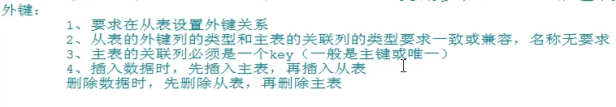
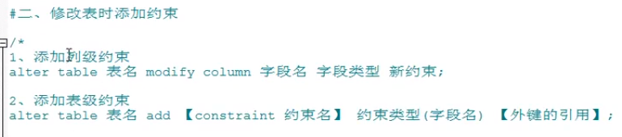
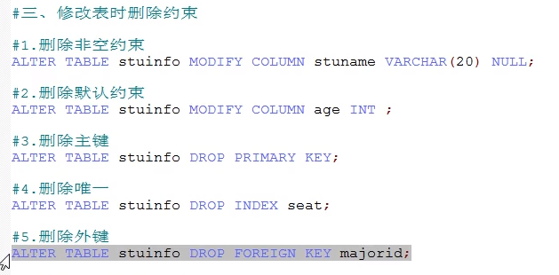

### 数据定义语言

#### 1、库的管理

  - 创建 create

    - create database if not exists 库名;

  - 修改 alter 

    - ```mysql
      #更改字符集
      CREATE DATABASE books CHARACTER SET utf8;
      ```

  - 删除 drop

    - drop database  if exists 库名；

#### 2、表的管理

  - 创建 create

    - ```mysql
      create table 表名(
      	列名，列的类型【长度，约束】,
      	列名，列的类型【长度，约束】,
      	列名，列的类型【长度，约束】
      	...
      )
      ```

  - 修改 alter

    - 修改列名

      - ```mysql
        ALTER TABLE book CHANGE COLUMN old_name new_name;
        ```

    - 修改列的类型或约束

      - ```mysql
        ALTER TABLE book MODIFY COLUMN column_name new_type;
        ```

    - 添加新的列

      - ```mysql
        ALTER TABLE book ADD COLUMN column_name column_type;
        ```

    - 删除列

      - ```mysql
        ALTER TABLE book DROP column_name;
        ```

    - 修改表名

      - ```mysql
        ALTER TABLE table_name RENAME TO  new_table_name;
        ```

  - 删除 drop

    - ```mysql
      DROP TABLE IF EXISTS table_name;
      ```
#### 3、表的复制

  - ```mysql
    #仅仅复制表结构
    CREATE TABLE coly LIKE source_table;
    #复制表的内容和结构
    CREATE TABLE copy
    SELECT * FROM source_table; 
    #如果只需要复制部分，则在后加筛选条件
    ```


#### 4、常见约束

用于限制表中的数据，为了保障数据的一致性，可靠性。

六代约束

- not null 非空约束 ,保障该字段的值不能为空
- default 默认值  ，用于保障该字段有默认值
- primary key 主键约束 用于保证该字段的值具有唯一性，并且非空
- unique 唯一，用于保证该字段具有唯一性，可以为空
- check 检查约束【mysql中不支持】
- foreign key  外键 用于限制两个表的关系，用于保证该字段的值比武来自主表的关联列的值

##### 1、添加列级约束

```mysql
CREATE TABLE stuinfo (
  id INT PRIMARY KEY,
  stuName VARCHAR (20) NOT NULL,
  gender CHAR(1) CHECK (gender = '男' 
    OR gender = '女'),
  seat INT UNIQUE,
  age INT DEFAULT 18,
  majorId INT REFERENCES major (id) #外键
) ;

CREATE TABLE major(
id INT PRIMARY KEY,
majorName VARCHAR(20)
);
```

##### 2、添加表级约束

```mysql
CREATE TABLE stuinfo (
  id INT,
  stuName VARCHAR (20),
  gender CHAR(1),
  seat INT,
  age INT,
  majorid INT,
  CONSTRAINT pk PRIMARY KEY (id),
  #主键
  CONSTRAINT uq UNIQUE (seat),
  CONSTRAINT ck CHECK (gender = '男' 
    OR gender = '女'),
  CONSTRAINT fk_stuinfo_major FOREIGN KEY (majorid) REFERENCES major (id)
) ;
```

列约束直接写在上面，表级约束直接写在后面。

###### 1、主键可以由多个列组成，组合主键


###### 2、外键



3、修改表时添加约束

- 列级约束，和修改列是一样的。

  ```mysql
  ALTER TABLE stuinfo MODIFY COLUMN stuname VARCHAR(20) NOT NULL;
  ```

- 表级约束

  ```mysql
  ALTER TABLE stuinfo ADD UNIQUE(seat)
  ```

- 添加外键

  ```mysql
  ALTER TABLE stuinfo ADD CONSTRAINT fk_stuinfo_major FOREIGN KEY(majorid) REFERENCES major(id);
  ```

  

  

  

#### 5、标识列

自增长列

可以不用手动插入，系统提供默认的序列值a

auto_increament; 这个自增长的步长可以设置。

- 自增长列，只有一个，且必须是一个key
- 修改表时可以设置标识列
- 修改表时可以删除标识列