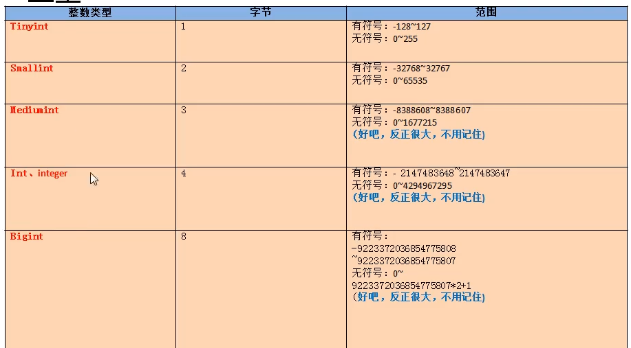

### 常见的数据类型

#### 1、数值型

1. 整型

   

   - 如何设置有符号和无符号，默认是有符号

     - ```mysql
       t1,int unsigned #设置无符号
       #如果插入的数据超过了范围，就会设置为临界值
       #对于int 设置长度并不会对数据的范围造成影响，数据的范围由类型唯一确定，也就是上面的表。
       #int(7) 这里的7只代表显示的宽度，如果不够会填充0,要想显示0，还要加上zerofill
       ```

2. 小数

   - 
   - D 表示小数点后面的长度 
   - M整数部位+小数部位
   - 如果超过临界值，则插入临界值
     - 如果是Decimal 则M默认是10,D默认为0
     - 如果是float 和double ，则会根据插入的数值的精度来决定精度。

#### 2、字符型

1. 较短的文本:char,varchar  
   - 
2. 较长的文本 :text,blob
3. enum 保存枚举
4. set 保存集合

#### 3、日期型


